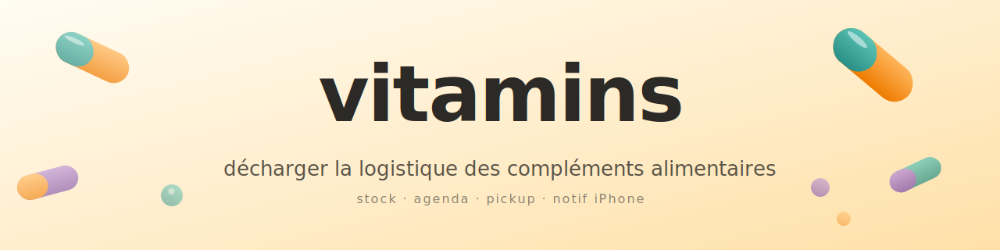

  

# vitamins

> Système personnel pour décharger la logistique des compléments alimentaires : suivi de stock, commandes auto-préparées (validation manuelle), rappels relais colis dans l'agenda, notifs iPhone, log quotidien des prises par tap.

## Le problème à résoudre

La gestion des vitamines / compléments tient en 3 douleurs :

1. **Charge mentale** — se souvenir de ce qu'il reste, de combien on consomme, de quand commander, de quel relais retient le colis, et avant quand aller le chercher. Trop d'états à porter en tête.
2. **Logistique colis** — un colis arrive dans un relais (Mondial Relay / Colissimo / Chronopost) qui le garde 7-14 j ; passé ce délai il repart à l'expéditeur. Oublier = re-payer la livraison.
3. **Réapprovisionnement** — courir à la fin du flacon et commander en panique, ou commander trop tôt et accumuler.

## Ce que le système fait pour moi

- **Suit le stock** par produit, calcule la date de rupture en fonction de la dose journalière.
- **Passe les commandes** quand la rupture approche (V1 : prépare un brouillon que je valide en 1 clic ; V2 : full auto si je l'autorise).
- **Pose un événement dans mon agenda Google** dès qu'un colis arrive au relais : *"Récupérer [produit] chez [relais] — avant le [deadline]"*.
- **Me notifie sur mon iPhone** : commande à passer, colis arrivé, deadline qui approche.

Objectif : que je ne pense plus à mes vitamines tant qu'un événement n'apparaît pas dans mon agenda ou mon écran de verrouillage.

## Status

WIP — création du repo. Stack à choisir, modèle domaine à esquisser, intégrations (Google Calendar / IMAP relais / Pushover ou HA Companion / Playwright pour auto-order) à câbler.

Voir [TASKS.md](TASKS.md) pour l'état du backlog.

## Documentation

- [docs/architecture.md](docs/architecture.md) — comparaison des 3 options d'archi (PWA / backend Python / native iPhone), avec critères de décision.
- [docs/integrations.md](docs/integrations.md) — design notes par intégration (Google Calendar, IMAP Gmail, HA Companion push, Playwright auto-order).
- [docs/scope-questionnaire.md](docs/scope-questionnaire.md) — questionnaire pour figer le scope avant le premier code commit (avec Google Apps Script pour générer le Form correspondant).

## Garde-fous explicites

- **Aucune commande passée sans validation utilisateur**. Même avec une allowlist (vendeur + produit + prix max + fréquence min), chaque achat fait l'objet d'un push qui demande "OK pour passer cette commande ? [Valider] [Annuler]".
- **Stock décrémenté par tap, pas par formule théorique**. L'utilisateur confirme chaque prise via un bouton (notif quotidienne ou widget). La dose prescrite sert juste au démarrage et au calcul de prédiction.
